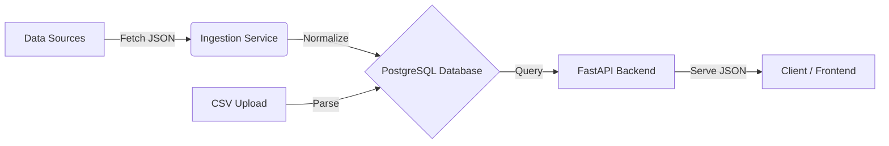

# 🚀 Kasparro Backend - Crypto Analytics Platform

A high-performance backend system for ingesting, normalizing, and serving cryptocurrency market data. This project demonstrates a robust **ETL Pipeline** and **RESTful API** architecture.

---

## 🏗 Architecture

The system follows a **Service-Oriented Architecture (SOA)** with a focus on data integrity and modularity.



### Key Components:
1.  **Ingestion Engine:** Fetches data from multiple sources (CoinPaprika, CoinGecko) and normalizes it into a unified schema.
2.  **Raw Data Storage:** Implements an "Audit Trail" by storing raw JSON payloads before processing.
3.  **API Layer:** Fast, paginated endpoints served via **FastAPI** and **Uvicorn**.
4.  **Containerization:** Fully Dockerized environment for consistent deployment.

---

## 🛠 Tech Stack
-   **Language:** Python 3.9
-   **Framework:** FastAPI
-   **Database:** PostgreSQL 15
-   **ORM:** SQLAlchemy
-   **Infrastructure:** Docker & Docker Compose

---

## ⚡️ Quick Start (Local)

### Prerequisites
-   Docker & Docker Compose installed.

### 1. Clone the Repository
```bash
git clone <YOUR_REPO_URL>
cd kasparro-backend
```

### 2. Configure Environment
Create a `.env` file in the root directory:
```env
DATABASE_URL=postgresql://postgres:postgres@db:5432/kasparro
COINPAPRIKA_API_KEY=your_key_here
COINGECKO_API_KEY=your_key_here
```

### 3. Run with Docker
```bash
docker-compose up --build -d
```

### 4. Initialize Database & Data
```bash
# Create Tables
docker-compose exec backend python -m app.init_db

# Run ETL Pipeline (CoinPaprika + CoinGecko)
docker-compose run --rm backend python -m app.ingestion.pipeline

# Load Historical CSV Data
docker-compose exec backend python -m app.ingestion.csv_loader
```

---

## 📡 API Endpoints

| Method | Endpoint | Description |
| :--- | :--- | :--- |
| `GET` | `/health` | Check DB connection and system status. |
| `GET` | `/data` | Retrieve market data (Supports pagination `limit` & `offset`). |

**Example Request:**
```bash
curl "http://localhost:8000/data?limit=5&symbol=BTC"
```

---

## ✅ Completed Requirements

- [x] **Tier P0: Foundation**
    - [x] Dockerized Environment
    - [x] PostgreSQL Database with SQLAlchemy Models
    - [x] Data Ingestion (CoinPaprika API + CSV)
- [x] **Tier P1: Reliability**
    - [x] Multi-source support (Added CoinGecko)
    - [x] Data Normalization
    - [x] Raw Data Auditing
